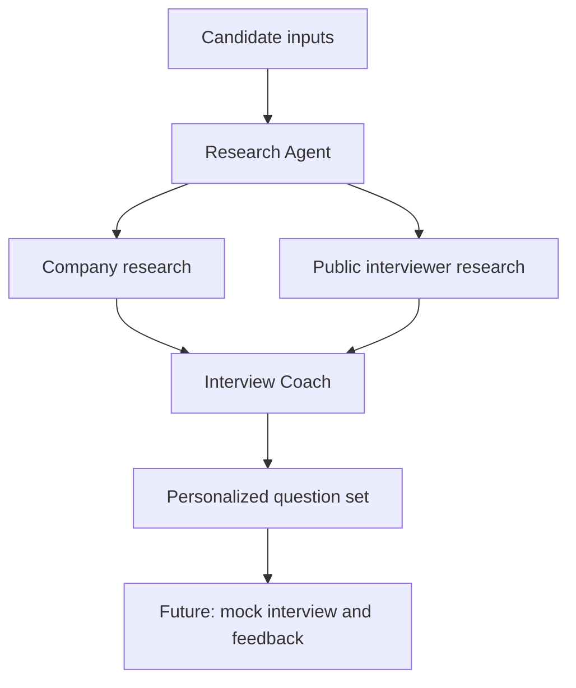

# CrewAI Interview Prep Agent

[](https://colab.research.google.com/github/Shankar1371/Crewai_interviewagent/blob/main/CrewAI_Interview_Prep_part_2.ipynb)


A multi-agent interview-preparation assistant built with CrewAI. The project explores how specialized AI agents can collaborate to research a company and interviewer, analyze a target role, and create personalized interview questions.

> **Project status:** This repository currently contains an experimental Google Colab prototype. The core workflow is being developed and is not yet a production-ready application.

## Why I Am Building This

Generic interview-question lists do not account for a candidate's target company, job description, or interviewer. This project aims to create a more useful preparation experience by assigning those responsibilities to specialized agents and combining their work in a sequential CrewAI workflow.

It is also a practical way for me to strengthen my skills in:

- Multi-agent orchestration and task delegation
- LLM-powered application development
- Tool use and real-time web research
- Prompt design and context sharing between agents
- API integration, secure secret management, and structured outputs
- Testing, evaluation, deployment, and observability for AI systems

## Current Prototype

The notebook currently defines the foundation of the system:

- Collects the company, job title, job description, and optional interviewer name
- Uses a **Research Agent** with Serper search and website-scraping tools
- Uses an **Interview Coach Agent** to create role-specific preparation questions
- Passes research results into downstream tasks through CrewAI context
- Organizes tasks in a sequential process
- Plans text exports for company research and interview-preparation results

### Current Agent Workflow



The original visual workflow is also available below:


## Agents and Responsibilities

| Agent | Responsibility | Status |
|---|---|---|
| Research Agent | Research the company, its industry, recent developments, and publicly available interviewer background | In progress |
| Interview Coach | Use the research and job description to generate tailored interview questions | In progress |
| Answer Evaluation Agent | Score responses for relevance, structure, clarity, and technical accuracy | Planned |
| Feedback Agent | Provide specific improvements and stronger example responses | Planned |
| Report Agent | Summarize performance, strengths, gaps, and next steps | Planned |

## Technology Stack

- Python
- CrewAI and CrewAI Tools
- OpenAI-compatible LLM
- Serper API
- Website scraping tools
- Google Colab
- LangChain OpenAI integration

## Repository Structure

```text
.
├── CrewAI_Interview_Prep_part_2.ipynb  # Experimental CrewAI workflow
└── README.md                            # Project documentation and roadmap
```

## Running the Prototype

1. Open the notebook using the **Open in Colab** badge.
2. Install the current dependencies:

   ```python
   !pip install "crewai[tools]" langchain-openai
   ```

3. Add these secrets in Google Colab under **Secrets**:

   ```text
   OPENAI_API_KEY
   SERPER_API_KEY
   ```

4. Run the notebook cells in order and provide:

   - Company name
   - Target job position
   - Job description
   - Interviewer name, if known

> The notebook is under active development and may require fixes as CrewAI and its dependencies evolve. Never commit API keys to the repository.

## Development Roadmap

### Phase 1 — Stabilize the Core Workflow

- Fix and validate the notebook from setup through final output
- Pin dependencies and add a reproducible requirements file
- Improve input validation and error handling
- Separate agent, task, tool, and configuration logic into Python modules
- Add structured JSON or Pydantic outputs

### Phase 2 — Personalized Interview Coaching

- Parse uploaded resumes and job descriptions
- Generate technical, behavioral, and company-specific questions
- Conduct an interactive mock interview one question at a time
- Evaluate answers using transparent scoring rubrics
- Recommend improved answers using the STAR method where appropriate
- Generate a final preparation report with strengths and skill gaps

### Phase 3 — Application and Production Engineering

- Build a simple Streamlit or React/FastAPI interface
- Store interview sessions and track improvement over time
- Add automated tests, prompt evaluations, and regression datasets
- Containerize the application with Docker
- Add logging, latency and token-cost tracking, and failure monitoring
- Deploy the application to a cloud platform with CI/CD

### Phase 4 — Advanced Capabilities

- Add voice-based mock interviews
- Support multiple LLM providers
- Introduce human approval points for research and scoring
- Add retrieval from candidate-provided notes and portfolio projects
- Build agent-quality evaluations for relevance, factuality, and consistency

## Future Goal

My long-term goal is to turn this prototype into a reliable, full-stack AI interview-coaching platform. The finished system should help candidates move from a job description to a personalized preparation plan, realistic practice sessions, measurable feedback, and a clear record of improvement.

From an engineering perspective, I want the project to demonstrate more than prompt experimentation. I plan to develop it into a tested and observable agentic application with modular services, secure API integrations, structured outputs, evaluation pipelines, containerized deployment, and a user-facing interface.

## Responsible Use

Interviewer research should use only relevant, publicly available professional information. The system should avoid sensitive personal data, verify time-sensitive claims, cite research sources where possible, and present generated feedback as coaching rather than an objective hiring decision.

## Contributing

This is currently a personal learning and portfolio project. Suggestions, issues, and constructive feedback are welcome.

## Author

**Sankar Punati**

## License

This repository is currently intended for learning and portfolio use. A formal open-source license may be added in a future release.
